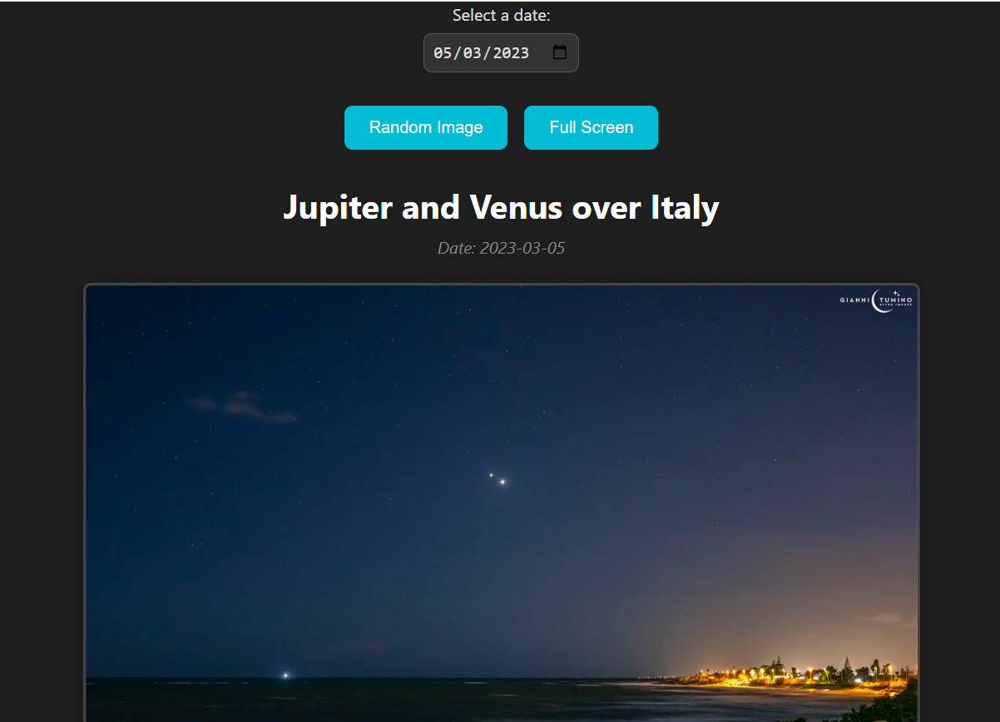

# 🚀 NASA Panel

## Astronomy Dashboard Powered by NASA APIs

NASA Panel is a web application that consumes NASA's Astronomy Picture of the Day (APOD) API and presents astronomical content through a modern and responsive interface.

The project was developed to strengthen skills in API integration, JSON processing, backend development with Node.js, and containerized deployment using Docker.

This application demonstrates how modern systems interact with external services, process API responses, and transform raw data into meaningful user experiences.

---

## ✨ Features

* NASA APOD API Integration
* Dynamic Image Rendering
* Dynamic Description Rendering
* Date-Based Search
* Random Astronomy Image
* Full Screen Image View
* Responsive Layout
* Backend with Node.js
* Docker Support
* Environment Variable Configuration

---

## 🛠 Technologies Used

### Frontend

* HTML5
* CSS3
* JavaScript

### Backend

* Node.js
* Express.js

### Infrastructure

* Docker
* Docker Compose

### External Services

* NASA Open APIs

### Development Tools

* Git
* GitHub

---

## 🎯 Skills Demonstrated

This project demonstrates practical experience with:

* API Integration
* JSON Processing
* External Service Consumption
* Backend Development
* Asynchronous Requests
* Environment Variables
* Docker Containerization
* Frontend Rendering
* Error Handling
* Data Visualization

These are common skills used when integrating third-party services in production environments.

Examples:

* Stripe
* PayPal
* Twilio
* SendGrid
* AWS Services
* OpenAI APIs

---

## 🏗 Application Architecture

Application Flow:

User Request

↓

Node.js Backend

↓

NASA APOD API

↓

JSON Response

↓

Data Processing

↓

Frontend Rendering

↓

User Interface

This architecture demonstrates how backend systems communicate with external APIs and deliver processed information to end users.

---

## 📸 Preview

### Dashboard



---

## ⚙️ Running Locally

Clone the repository:

```bash
git clone https://github.com/livansena/NASA-Panel.git
```

Navigate to the project folder:

```bash
cd NASA-Panel
```

Install dependencies:

```bash
npm install
```

Start the application:

```bash
npm start
```

---

## 🔐 Environment Variables

Create a `.env` file in the root directory:

```env
NASA_API_KEY=your_api_key_here
```

You can obtain a free API key directly from NASA Open APIs.

---

## 🔮 Future Improvements

Planned enhancements include:

* Mars Rover Photos Integration
* Near Earth Objects Dashboard
* Space Weather Information
* Multiple NASA APIs
* Advanced Filtering
* Improved Mobile Experience
* Enhanced Error Handling

---

## 🌍 Real-World Relevance

Modern software systems frequently depend on external integrations.

NASA Panel was created to demonstrate the ability to:

* Connect to external services
* Process remote data
* Handle API responses
* Manage environment variables
* Deploy applications using containers
* Transform raw information into usable interfaces

---

## 👨‍💻 Author

### Livan Passos

Backend Developer focused on:

* Ruby on Rails
* PostgreSQL
* REST APIs
* Backend Architecture
* Software Engineering

### Connect with Me

LinkedIn:

https://www.linkedin.com/in/livanpassos/

Portfolio:

https://livanpassos.com

---

## 🎯 Professional Philosophy

After more than 15 years working in industrial maintenance, quality assurance, operations, logistics, and critical environments, I transitioned into software development with a clear objective:

Building reliable systems that solve real business problems.

The same principles that drive operational excellence — discipline, continuous improvement, attention to detail, and problem-solving — are now applied to software engineering.

**The tools changed. The mindset did not.**

---

## 📄 License

This project was developed for educational and portfolio purposes.
